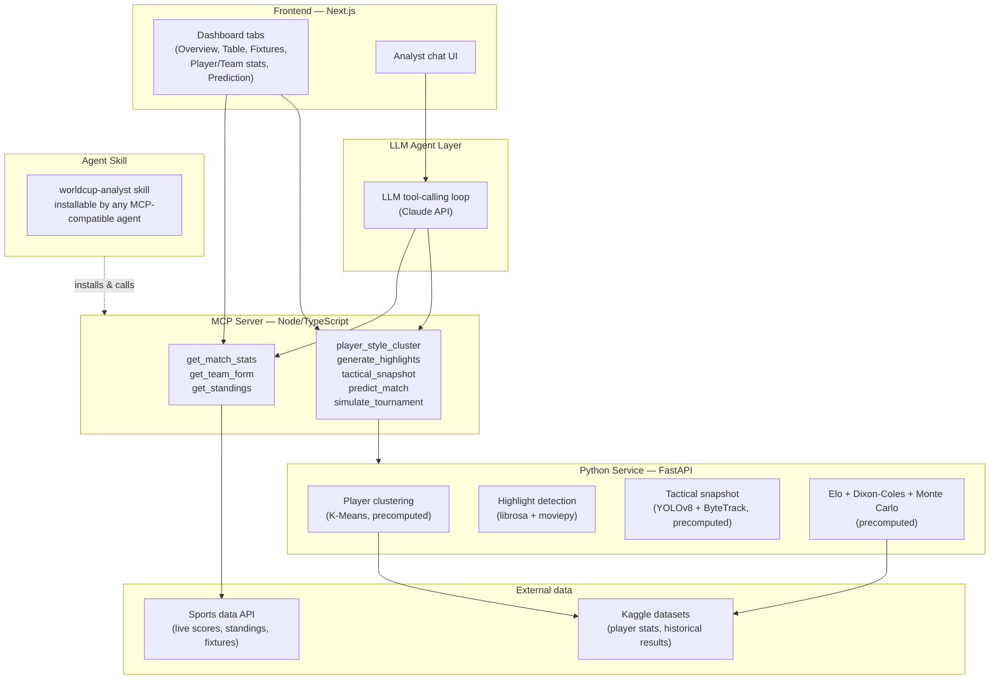

# FULL BACK


---


---

**A complete AI-powered World Cup platform — live data, player analytics, match predictions, and a conversational assistant, all in one place.**

FULL BACK lets a fan (or any AI agent) ask natural-language questions about the World Cup — live scores, standings, player style comparisons, match predictions, tactical breakdowns — and get answers grounded in real data, not guesses. Everything is free to use, no wallet or payment required.

---

## Table of contents

- [What this is](#what-this-is)
- [Features](#features)
- [Architecture](#architecture)
- [Tech stack](#tech-stack)
- [Injective technologies used](#injective-technologies-used)
- [Project structure](#project-structure)
- [Getting started](#getting-started)
- [Environment variables](#environment-variables)
- [Data sources & credits](#data-sources--credits)
- [Known limitations](#known-limitations)
- [License](#license)

---

## What this is

FULL BACK is built around one core idea: an **MCP server** exposes a set of World Cup analysis tools, and those same tools are usable in two ways —

1. Through a **fan-facing dashboard and chat interface** on the website
2. Through any **AI agent** that installs the accompanying **Agent Skill**, giving it the same World Cup expertise Claude Code (or any other MCP-compatible agent) can call directly

Every tool is free and open — no subscriptions, no per-query payment, no wallet.

## Features

### Dashboard
- **Overview** — live/today's matches, condensed standings, top storylines
- **Table** — full group standings by group
- **Fixtures** — match list by date, live score updates for in-progress matches
- **Player stats** — top scorers, top assists, linked into player style clustering
- **Team stats** — team form (recent results, goals for/against)
- **Prediction** — match win/draw/loss predictor and full tournament-odds simulation

### AI Analyst chat
A conversational interface where a fan asks a question and an LLM agent decides which MCP tool to call, executes it, and answers using the real result — never a hallucinated stat.

### Data-science features
- **Player style clustering** — K-Means clustering of players into playing styles based on historical per-90 stats (Transfermarkt data via Kaggle)
- **Highlight detection** — automatic detection of exciting moments in match audio via loudness-peak analysis
- **Tactical snapshot** — player/ball detection and tracking from match footage, with a zone-based tactical read (not precise pitch-coordinate mapping — see [Known limitations](#known-limitations))
- **Match & tournament prediction** — Elo team ratings + Dixon-Coles Poisson expected-goals model + Monte Carlo simulation, trained on ~150 years of international results

## Architecture



**How it works end to end:**
1. A fan interacts with the dashboard directly, or asks the Analyst chat a free-form question
2. The chat's LLM agent decides whether it needs live data — if so, it calls the relevant MCP tool rather than guessing
3. Simple tools (scores, standings, form) call the sports data API directly
4. Data-science tools (clustering, highlights, tactical snapshot, prediction) are backed by a Python service, most of which run as **one-time precomputed pipelines** rather than live-per-request computation
5. The same MCP server is installable as an **Agent Skill** by any other AI agent, giving it identical World Cup capabilities outside this website entirely

## Tech stack

- **Frontend:** Next.js, TypeScript, Tailwind
- **MCP server:** Node.js, TypeScript, `@modelcontextprotocol/sdk`
- **Data-science service:** Python, FastAPI
- **LLM:** Claude API (tool-calling)
- **ML/data libraries:** pandas, scikit-learn, librosa, moviepy, ultralytics (YOLOv8), supervision (ByteTrack), OpenCV
- **Deployment:** Vercel (frontend), Railway (backend services)

## Injective technologies used

This project was originally built for The Injective Global Cup hackathon, which asked entrants to meaningfully use x402, CCTP, MCP Server, and Agent Skills.

- **MCP Server** — ✅ core to the entire architecture, as described above
- **Agent Skills** — ✅ the whole tool set is packaged as an installable skill any MCP-compatible agent can use
- **x402 / CCTP** — initially integrated for cross-chain micropayments gating premium tools, but descoped during development due to reliability issues under time constraints. Rather than ship a broken payment flow, every tool was made freely accessible instead. This is a deliberate engineering tradeoff, not an oversight.

## Project structure

```
.
├── frontend/                 # Next.js app
│   ├── app/                  # Dashboard tabs, Analyst chat, Prediction section
│   └── components/           # Shared UI components
├── mcp-server/                # Node/TypeScript MCP server
│   └── src/
│       └── index.ts          # Tool registrations
├── python-service/            # FastAPI data-science service
│   ├── main.py
│   ├── build_clusters.py     # One-time: player clustering
│   ├── highlights.py          # Highlight detection
│   ├── tactical_snapshot.py   # One-time: tactical analysis
│   ├── build_elo_ratings.py  # One-time: Elo ratings from historical data
│   └── public/                # Precomputed static outputs (images, JSON)
└── README.md
```

## Getting started

### Prerequisites
- Python 3.10+
- `ffmpeg` installed on your system
- A sports data API key (e.g. football-data.org)
- An Anthropic API key (for the Analyst chat's LLM)

### Setup

```bash
# Clone the repo
git clone <your-repo-url>
cd full-back

# Frontend
cd frontend
npm install
npm run dev

# MCP server
cd ../mcp-server
npm install
npm run dev

# Python service
cd ../python-service
pip install -r requirements.txt --break-system-packages
# Run one-time precompute scripts before starting the API:
python build_clusters.py
python build_elo_ratings.py
uvicorn main:app --reload
```

### Installing the Agent Skill

```bash
# Copy the skill into your agent's skills directory
cp -r worldcup-analyst-skill ~/.claude/skills/
```
Refer to your MCP client's documentation for exact skill installation steps.

## Environment variables

Create a `.env` file at the project root:

```
# Sports data API
SPORTS_API_KEY=your_key_here

# LLM (Analyst chat)
ANTHROPIC_API_KEY=your_key_here

# Frontend (local dev)
NEXT_PUBLIC_API_URL=http://localhost:8000
```

## Data sources & credits

- Live match data: [football-data.org](https://www.football-data.org) / API-Football
- Player stats for clustering: [Transfermarkt data via Kaggle](https://www.kaggle.com/datasets/davidcariboo/player-scores)
- Historical results for prediction model: [International football results 1872–2017, Kaggle](https://www.kaggle.com/datasets/martj42/international-football-results-from-1872-to-2017)
- Sample match footage: sourced under free-use license from Pexels/Pixabay for demo/testing purposes only

## Known limitations

- **Tactical snapshot** uses screen-position zone estimates (defensive/middle/attacking thirds), not precise pitch-coordinate homography — the source footage didn't contain enough clear landmark points for a reliable metric transform, so the output is intentionally descriptive rather than presenting false precision
- **All-time top scorers** (if included in Overview) is a static, manually-sourced list, not live-computed — it can go stale if a current player breaks the record mid-tournament
- **Prediction model** confidence varies by team — nations with sparse historical match data in the training set will have less reliable Elo ratings than heavily-represented ones
- x402/CCTP payment infrastructure was descoped; see [Injective technologies used](#injective-technologies-used)

