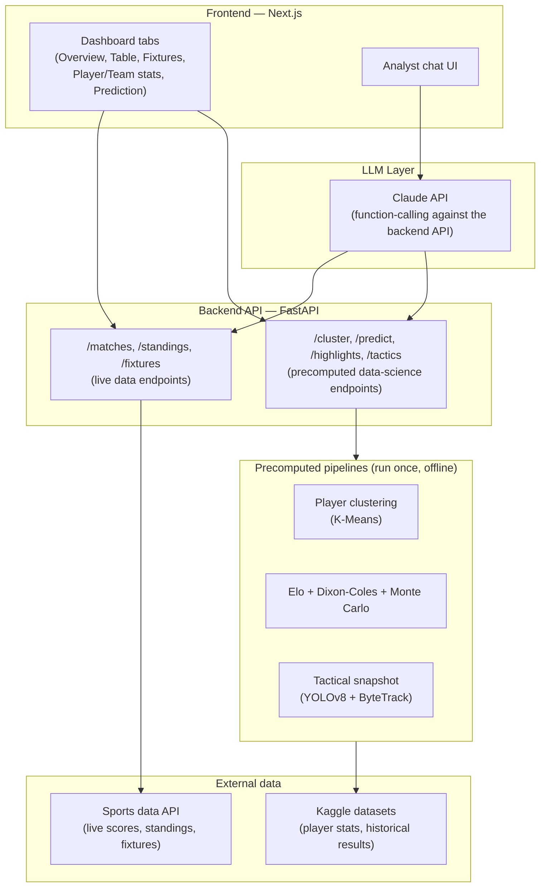

# FULL BACK


---


---

**An AI-powered World Cup platform — live scores, player analytics, match predictions, tactical breakdowns, and a conversational agent, all in one place.**

FULL BACK lets a fan ask natural-language questions about the World Cup — live scores, standings, player style comparisons, match predictions, tactical breakdowns — and get answers grounded in real data, not guesses. Everything is free to use, no wallet or payment required.

---

## Table of contents

- [What this is](#what-this-is)
- [Features](#features)
- [Architecture](#architecture)
- [Tech stack](#tech-stack)
- [Injective technologies used](#injective-technologies-used)
- [Project structure](#project-structure)
- [Getting started](#getting-started)
- [Environment variables](#environment-variables)
- [Data sources & credits](#data-sources--credits)
- [Known limitations](#known-limitations)
- [License](#license)

---

## What this is

FULL BACK is an AI-powered World Cup companion: a dashboard for live data and analytics, plus a conversational Analyst chat where an LLM decides what information it needs and calls the backend API to get it — rather than answering World Cup questions from memory.

Every feature is free to use — no subscriptions, no per-query payment, no wallet.

## Features

### Dashboard
- **Overview** — live/today's matches, condensed standings, top storylines
- **Table** — full group standings by group
- **Fixtures** — match list by date, live score updates for in-progress matches
- **Player stats** — top scorers, top assists, linked into player style clustering
- **Team stats** — team form (recent results, goals for/against)
- **Prediction** — match win/draw/loss predictor and full tournament-odds simulation, powered by an Elo + Dixon-Coles Poisson + Monte Carlo model

### AI Analyst chat
A conversational interface where a fan asks a question and an LLM (Claude API) determines what data it needs, calls the backend API to retrieve it, and answers using the real result rather than a hallucinated stat.

### Data-science features
- **Player style clustering** — K-Means clustering of players into playing styles based on historical per-90 stats (Transfermarkt data via Kaggle), precomputed and served from CSV
- **Highlight detection** — automatic detection of exciting moments in match audio via loudness-peak analysis
- **Tactical snapshot** — player/ball detection and tracking from match footage, with a zone-based tactical read (not precise pitch-coordinate mapping — see [Known limitations](#known-limitations))
- **Match & tournament prediction** — Elo team ratings + Dixon-Coles Poisson expected-goals model + Monte Carlo simulation, trained on ~150 years of international results, precomputed and served from CSV

## Architecture



**How it works end to end:**
1. A fan interacts with the dashboard directly, or asks the Analyst chat a free-form question
2. The chat's LLM decides whether it needs data — if so, it calls the backend API rather than guessing
3. Live endpoints (scores, standings, fixtures) call the sports data API directly
4. Data-science endpoints (clustering, highlights, tactical snapshot, prediction) read from **precomputed CSV/JSON files**, generated by one-time offline pipelines — nothing here is computed live per request

> **Note on architecture:** this project does not currently implement the Model Context Protocol (MCP) or an installable Agent Skill. The LLM integration is direct API function-calling from the Analyst chat to this project's own backend, not a standalone MCP server that other agents could independently connect to. See [Injective technologies used](#injective-technologies-used) below.

## Tech stack

- **Frontend:** Next.js, TypeScript, Tailwind
- **Backend API:** Python, FastAPI
- **LLM:** Claude API (function-calling)
- **ML/data libraries:** pandas, scikit-learn, librosa, moviepy, ultralytics (YOLOv8), supervision (ByteTrack), OpenCV
- **Deployment:** Vercel (frontend), Railway (backend)

## Injective technologies used

This project was originally started for The Injective Global Cup hackathon, which asked entrants to meaningfully use x402, CCTP, MCP Server, and Agent Skills.

- **MCP Server** — ❌ not implemented. The original plan called for wrapping the backend's tools in an actual MCP server; in the final build, the LLM integration calls the backend API directly instead.
- **Agent Skills** — ❌ not implemented. This was designed to expose the MCP server's tools to other agents, so without an MCP server, there's currently nothing for a skill to wrap.
- **x402 / CCTP** — descoped during development due to reliability issues under time constraints. Every feature is freely accessible instead of payment-gated.

This project ended up as a fully-functional AI-powered World Cup platform, but does not currently fulfill the hackathon's specific Injective-technology integration requirements.

## Project structure

```
.
├── frontend/                       # Next.js app
│   ├── app/                        # Dashboard tabs, Analyst chat, Prediction section
│   └── components/                 # Shared UI components
├── backend/                        # FastAPI backend
│   ├── main.py
│   ├── build_clusters.py           # One-time: player clustering
│   ├── highlights.py               # Highlight detection
│   ├── tactical_snapshot.py        # One-time: tactical analysis
│   ├── build_elo_ratings.py        # One-time: Elo ratings from historical data
│   └── public/                     # Precomputed static outputs (CSV/JSON, images)
└── README.md
```

## Getting started

### Prerequisites
- Python 3.10+
- `ffmpeg` installed on your system
- A sports data API key (e.g. football-data.org)
- An Anthropic API key (for the Analyst chat's LLM)

### Setup

```bash
# Clone the repo
git clone <your-repo-url>
cd full-back

# Frontend
cd frontend
npm install
npm run dev

# Backend
cd ../backend
pip install -r requirements.txt --break-system-packages
# Run one-time precompute scripts before starting the API:
python build_clusters.py
python build_elo_ratings.py
uvicorn main:app --reload
```

## Environment variables

Create a `.env` file at the project root:

```
# Sports data API
SPORTS_API_KEY=your_key_here

# LLM (Analyst chat)
ANTHROPIC_API_KEY=your_key_here

# Frontend (local dev)
NEXT_PUBLIC_API_URL=http://localhost:8000
```
# Demo Pic

## Home


## Dashbord


## Analyst


## Players


## Prediction


## Data sources & credits

- Live match data: [football-data.org](https://www.football-data.org) / API-Football
- Player stats for clustering: [Transfermarkt data via Kaggle](https://www.kaggle.com/datasets/davidcariboo/player-scores)
- Historical results for prediction model: [International football results 1872–2017, Kaggle](https://www.kaggle.com/datasets/martj42/international-football-results-from-1872-to-2017)
- Sample match footage: sourced under free-use license from Pexels/Pixabay for demo/testing purposes only

## Known limitations

- **No MCP server or Agent Skill** — see [Injective technologies used](#injective-technologies-used)
- **Tactical snapshot** uses screen-position zone estimates (defensive/middle/attacking thirds), not precise pitch-coordinate homography — the source footage didn't contain enough clear landmark points for a reliable metric transform, so the output is intentionally descriptive rather than presenting false precision
- **All-time top scorers** (if included in Overview) is a static, manually-sourced list, not live-computed — it can go stale if a current player breaks the record mid-tournament
- **Prediction model** confidence varies by team — nations with sparse historical match data in the training set will have less reliable Elo ratings than heavily-represented ones
- x402/CCTP payment infrastructure was descoped; see [Injective technologies used](#injective-technologies-used)
