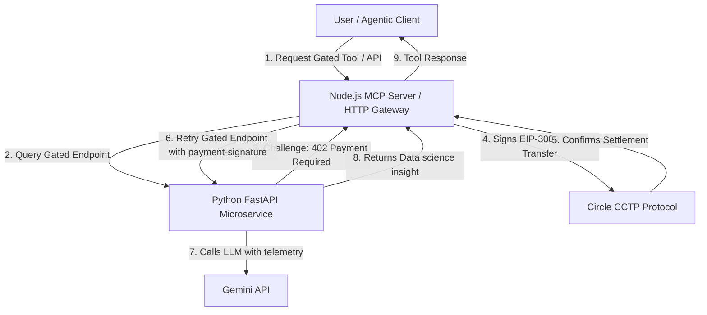

# FULL BACK
### An AI analyst that has the fan's back — on and off the pitch


---


---

## The name, decoded

A full back is the defensive position that also drives the attack — covers your flank, then joins the run forward. That's the product: it defends the fan's spend (verifiable, per-query payment, no subscriptions, no lock-in) while pushing the analysis forward (AI-generated tactical insight most fans can't get anywhere else).

It also reads as **"you're backed"** — every premium answer is backed by a real, on-chain, stablecoin payment. No accounts. No API keys. No trust required.

---

## One-liner

**FULL BACK is an AI match analyst, exposed as an MCP server, that any fan or any agent can query for World Cup insight — free for the basics, pay-per-query in USDC for the deep analysis, from any chain, no wallet gymnastics required.**

---

## The problem

World Cup content today is either:
- **Free but shallow** — scores, standings, headlines
- **Deep but gated behind subscriptions** — paid analytics platforms that want a monthly commitment for something you might use twice during the tournament
- **Built for humans only** — no fan-facing product today is built so that an AI agent (yours, a friend's, a future one) can query it directly and get structured, payable, verifiable answers

Fans want the deep stuff — win probabilities, tactical breakdowns, player-style comparisons — but only when they actually want it, for a match that actually matters to them. Subscriptions are the wrong shape for that.

---

## The idea

A single MCP server sits at the center. It exposes tools an AI agent (or a simple chat UI) can call:

**Free tier** — live scores, standings, team form. The basics, no friction.

**Premium tier** — gated behind an [x402](https://x402.org) micropayment. Ask "how will Brazil do against Argentina tonight" and get a genuine AI-generated tactical breakdown for a few cents in USDC, paid instantly, no signup.

**Pay from anywhere** — via [CCTP](https://www.circle.com/cross-chain-transfer-protocol), a fan whose USDC lives on Ethereum, Solana, or wherever pays fine — settlement lands wherever the server needs it, without the fan manually bridging first. This is the piece almost nobody else in the hackathon will bother building, and it's the difference between "we integrated x402" and "we solved the actual UX problem x402 creates."

**Reusable, not just a demo** — the same logic is packaged as an installable **Agent Skill**, so any developer's AI agent (Claude Code, or anyone else's) can install `worldcup-analyst` and get World Cup expertise for free, then pay per premium call. It's a developer tool, not just an app.

---

## Core features

| Feature | Tier | Powered by |
|---|---|---|
| Live scores & standings | Free | MCP tool, sports data API |
| Team form lookup | Free | MCP tool |
| AI match prediction & tactical writeup | Premium | LLM + x402 paywall |
| Player-style clustering ("which players play like X") | Premium | pandas + K-Means, x402 paywall |
| AI-generated highlight clips from match audio | Premium (stretch) | librosa + moviepy, x402 paywall |
| Formation snapshot from match footage | Bonus/stretch | YOLOv8 + homography, shown as a static result, not a live feature |
| Cross-chain payment | Infrastructure | CCTP |
| Installable analyst skill for other agents | Developer tool | Agent Skills |

---

## USP — why this wins

1. **All four required technologies, used for a reason, not for compliance.** Most entrants will use one or two superficially. Here, x402 gates real value, CCTP solves a real UX gap x402 itself doesn't answer, MCP is the actual product architecture (not a wrapper bolted on at the end), and Agent Skills make the work reusable by other builders.
2. **Real without the blockchain.** The free tier is a genuinely useful dashboard on its own — judges can evaluate usability even if they never touch the payment flow.
3. **The demo tells a complete story in 90 seconds.** Free question → hits a premium wall → pay from a wallet on a different chain → answer arrives. That loop, working reliably, is more persuasive than five half-finished features.
4. **Data science with a clear head, not scope creep.** Player clustering is fully built and monetized. Highlights is a nice-to-have. Formation tracking is explicitly a bonus screenshot, not a promise — judges respect honest scoping more than an over-promised feature that visibly breaks in the demo.

---

## Two user flows

**Fan flow:** open the dashboard → check today's fixtures and form for free → ask the chat widget a tactical question → hit the paywall → pay a few cents in USDC from whatever wallet they already have → get a genuinely useful, AI-written answer.

**Developer flow:** `npx skills add` the `worldcup-analyst` skill into their own agent → their agent now knows how to query FULL BACK's MCP server → their agent can autonomously pay per call when it needs premium data, with no human re-entering payment details.

---

## Design language

The homepage sets the tone — carry it through:
- Near-black backgrounds, single orange accent color for live/active states
- Monospace, all-caps micro-labels for data readouts (mirroring the "LATITUDE / FLOODLIGHT" telemetry style) — use this pattern for match stats, odds, and payment confirmations ("SETTLED · 0.08 USDC · BASE")
- Bold condensed display type for headlines, restrained everywhere else
- The stadium-at-night photography motif can extend into the dashboard as a subtle background texture, not a busy one

---

## Architecture (recap)

```
Fan dashboard ──┐
                 ├──▶ MCP server ──┬──▶ Free tools (scores, standings)
External agents ─┘                 └──▶ Premium tools ──▶ x402 paywall ──▶ CCTP settlement
                                                │
                                          Agent Skill (packaged for reuse)
```

---

## Technical Architecture



---

## Why Injective & Circle Technology Stack?

### 1. x402 Micropayments
**Standardizes pay-per-query AI.** Instead of monthly subscriptions or API key gates, x402 uses standard HTTP 402 headers to charge clients dynamically in USDC. This allows AI agents to transact autonomously.

### 2. Circle CCTP (Cross-Chain Transfer Protocol)
**Solves multi-chain friction.** AI developers and fans shouldn't need to manually bridge funds to Injective to query the server. CCTP burns USDC on the client source chain (like Ethereum or Solana) and mints it on the target chain (Base/Injective) in a single unified flow.

### 3. Model Context Protocol (MCP)
**Unifies human and machine execution.** The analyst is packaged as an MCP server. This means any LLM client (Cursor, Claude Desktop, custom agents) can natively discover and call FULL BACK tools.

### 4. Agent Skills
**Modular reusability.** By distributing the analyst as an installable skill under the Open Agent Skills standard, other developers can add sports-analyst telemetry to their own agents with a single command.

---

## Local Setup Instructions

### 1. Requirements
*   **Node.js**: v20+
*   **Python**: v3.10+
*   **npm** / **pip**

### 2. Environment Setup
Clone the repository and copy the template configuration:
```bash
cp .env.example .env
```
Fill in the configuration details inside `.env`:
*   `SPORTS_DATA_API_KEY`: Your football API key.
*   `INJECTIVE_PRIVATE_KEY` & `X402_SECRET_KEY`: Wallet private key to sign/handle payments.
*   `GEMINI_API_KEY`: API key for Gemini models.

### 3. Run the Python Data Science Service
```bash
cd python-service
# Install dependencies
pip install -r requirements.txt
# Run the FastAPI server
python main.py
```
This runs the microservice on `http://localhost:8000`.

### 4. Run the Node MCP Server
```bash
cd mcp-server
# Install dependencies
npm install
# Compile TypeScript and run
npm run start
```
This starts the Stdio MCP server bridge.

### 5. Run the Frontend Dashboard
From the root directory:
```bash
# Install packages
npm install
# Run local Vite dashboard
npm run dev
```
Open `http://localhost:5173` in your browser. Click **ENTER THE FIELD** to view the live dashboard.

